# KEPLER RC — SUBSISTEMA MECÁNICO

---

## Descripción

La característica de diseño más relevante es que **el robot está descompuesto en cinco módulos independientes**, cada uno con su propia función estructural e interfaces definidas. Esto permite:

- Reemplazar un módulo dañado sin desarmar el resto.
- Iterar geometrías (p. ej. ángulo de navaja, distancia entre ejes) imprimiendo una sola pieza.
- Repartir el trabajo de manufactura: el chasis se maquina, las cuatro piezas restantes se imprimen.

---

## Arquitectura modular

```mermaid
flowchart TB
    ROBOT(["KEPLER RC<br/>ensamble general"])

    ROBOT --> M1
    ROBOT --> M2
    ROBOT --> M3
    ROBOT --> M4
    ROBOT --> M5

    subgraph M1["M1 · CHASIS"]
        direction TB
        A1["Placa metálica<br/>70 × 50 × 7.5 mm"]
        A2["Función: estructura primaria<br/>+ lastre + referencia de datums"]
    end

    subgraph M2["M2 · PORTANAVAJAS"]
        direction TB
        B1["Pieza impresa · PLA"]
        B2["Navaja metálica"]
        B3["Función: fijar y angular<br/>la cuña frontal"]
    end

    subgraph M3["M3 · PORTALLANTAS"]
        direction TB
        C1["Pieza impresa · PLA ×2"]
        C2["2 × motor JSUMO Core"]
        C3["2 × llanta"]
        C4["Función: soporte de motor,<br/>eje y reacción de par"]
    end

    subgraph M4["M4 · CARCASA"]
        direction TB
        D1["Pieza impresa · PLA"]
        D2["Alojamiento batería + PCB"]
        D3["Función: envolvente,<br/>paredes inclinadas"]
    end

    subgraph M5["M5 · TAPA"]
        direction TB
        E1["Pieza impresa · PLA"]
        E2["Función: cierre superior,<br/>accesos y ranuras"]
    end

    style ROBOT fill:#118ab2,stroke:#333,color:#fff
    style M1 fill:#8d99ae,stroke:#333,color:#000
    style M2 fill:#e5e5e5,stroke:#333,color:#000
    style M3 fill:#ffd166,stroke:#333,color:#000
    style M4 fill:#ef476f,stroke:#333,color:#fff
    style M5 fill:#495057,stroke:#333,color:#fff
```

> [!NOTE]
> El **chasis** es la pieza de referencia del ensamble: todas las demás se posicionan respecto a sus caras y barrenos. Es la única pieza que no debe modificarse a la ligera, porque propaga tolerancias a los otros cuatro módulos.

---

## Módulos

### M1 · Chasis — metálico

| Campo | Valor |
| :--- | :--- |
| **Material** | Acero |
| **Manufactura** | Corte + barrenado (maquinado) |
| **Función** | Estructura primaria · lastre inferior · datum del ensamble |

---

### M2 · Portanavajas — PLA + navaja metálica

| Campo | Valor |
| :--- | :--- |
| **Material pieza** | PLA |
| **Material navaja** | Lámina metálica |
| **Manufactura** | Impresión 3D + corte de lámina |
| **Función** | Fijar la navaja al chasis con el ángulo de ataque correcto |

### M3 · Portallantas — PLA + motores + llantas

| Campo | Valor |
| :--- | :--- |
| **Material** | PLA (×2 piezas, izquierda/derecha) |
| **Manufactura** | Impresión 3D |
| **Contiene** | 2 × JSUMO Core DC 6 V 400 RPM · 2 × llanta |
| **Función** | Soporte del motor, alineación del eje |

---

### M4 · Carcasa — PLA

| Campo | Valor |
| :--- | :--- |
| **Material** | PLA |
| **Manufactura** | Impresión 3D |
| **Aloja** | Batería LiPo 3S · cableado |
| **Función** | Envolvente estructural, paredes inclinadas, gestión interna |

---

### M5 · Tapa — PLA

| Campo | Valor |
| :--- | :--- |
| **Material** | PLA |
| **Manufactura** | Impresión 3D · PCB Kepler |
| **Función** | Cierre superior, soporte PCB |

---

## Componentes 

| Componente | Especificación | Cant. | Módulo |
| :--- | :--- | :---: | :--- | 
| Motor JSUMO Core DC | 6 V · 400 RPM · 120 mA vacío · **3.2 A stall** · 21 g | 2 | M3 |
| Batería LiPo TATTU | 3S 450 mAh 75C · 11.1 V · 63 × 21 × 16.5 mm · XT30U-F | 1 | M4 | 
| Placa metálica | Acero, espesor 1/4" | 1 | M1 | 
| PCB Kepler RC Vol.1 | Ver [`electronics-info.md`](/electronics/electronics-info.md) | 1 | M4 | 
| **Llantas** | Cubo + neumático de silicón, minisumo | 2 | M3 | 
| **Navaja** | Katana Jsumo | 1 | M2 | 
| **Filamento PLA** | 1.75 mm | ~150 g | M2/M3/M4/M5 | 
| **Tornillería M3** | N/A | — | Todos | 
| **Insertos térmicos M3** | Cobre, OD 4.6 mm | ~12 | M2/M3/M4/M5 | 

---
